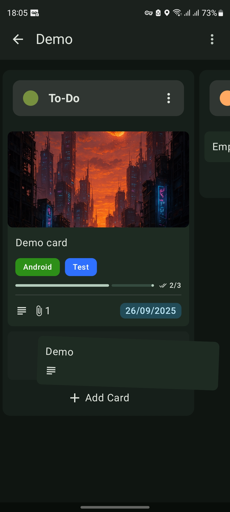
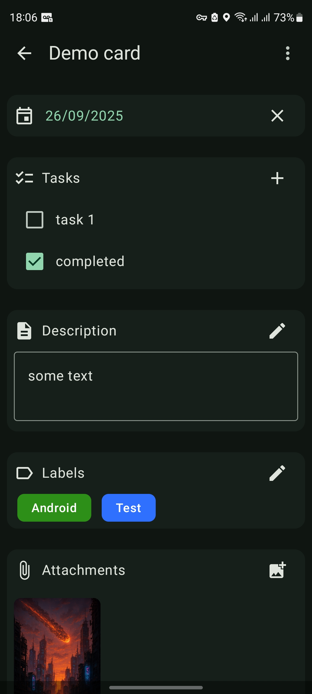

# KanOne - Kanban App for Android

KanOne is a offline kanban app, designed to help you organize tasks and manage projects

 

## 📱 Screenshots

  
  &nbsp;&nbsp;&nbsp;
  

 

## ✨ Features

- **Easy to use**
- **Create, Edit, and Delete Tasks**
- **Create labels**
- **Attach images** 
- **Drag & Drop**
- **Zoom in & Zoom out**
- **Material You**
- **Offline**

 

## 🛠️ Tech Stack
- Jetpack Compose
- Dagger Hilt
- RoomDB
- Coil
- Preferences DataStore

 

## ⬇️ Dowload

- Download the latest stable version from [GitHub releases](https://github.com/EduCost/KanOne/releases/latest)

 

## 📃 License
This project is licensed under [GPL-3.0](https://github.com/EduCost/KanOne/blob/main/LICENSE)

 

> [!Warning]
> This project is currently in **alpha stage**. Features are still being developed and things may change or break between updates.
